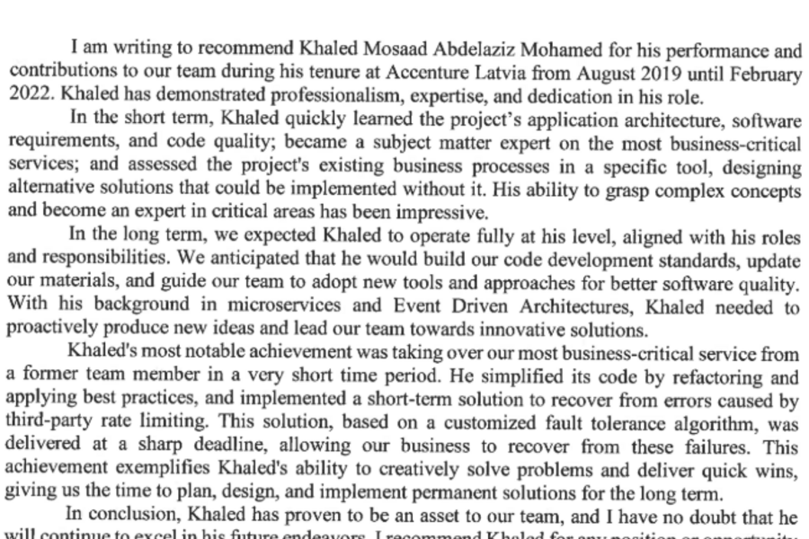
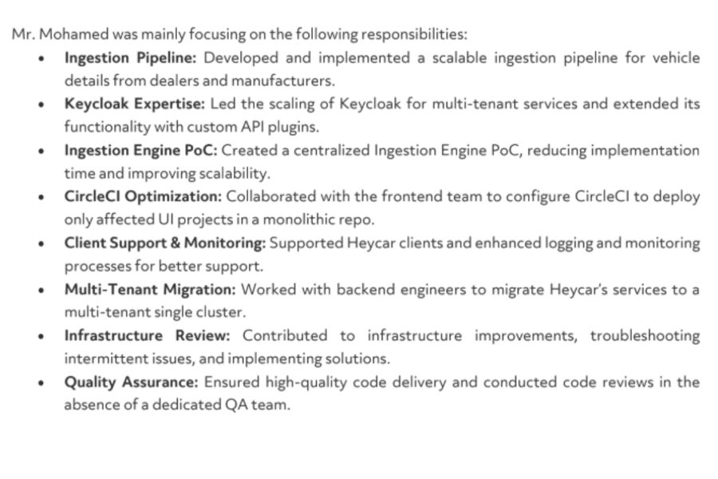
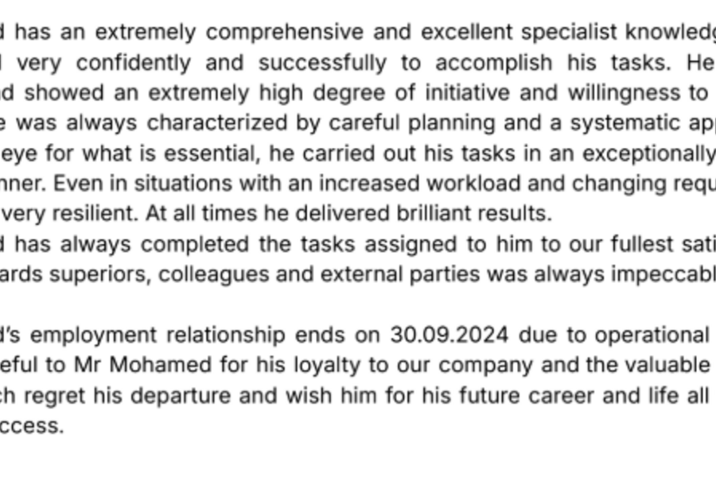

<h1 align="center">👋 Hi, I'm Khaled Mohamed</h1>
<h3 align="center">🚀 Staff Backend Engineer | Java & Kotlin Expert | Cloud-Native Architect | DevOps & Distributed Systems Specialist</h3>

  
  
  

---

## 🧑‍🚀 About Me

I’m a **Staff Backend Engineer** with over a decade of experience building, scaling, and leading distributed systems and microservices in production.  
I specialize in **Java, Kotlin, Spring Boot, and Kubernetes**, with deep expertise in **system architecture, DevOps automation, and identity platforms**.

- 🔭 Currently building **Autheto** – a multi-tenant Identity & Access platform powered by Keycloak  
- 🌍 Architecting **Masar** – a global “along-the-road services” API (EV, fuel, rescue, and more)  
- ☁️ Experienced in AWS, Kubernetes, PostGIS, event-driven systems, and large-scale data pipelines  
- 🧭 Known for **technical leadership**, mentoring teams, and driving architecture decisions  
- 📈 Passionate about developer productivity, scalability, and clean system design

---

## 🛠️ Tech Stack & Expertise

### 🚀 Languages & Frameworks

### 🗄️ Databases & Data Platforms

### ☁️ DevOps & Cloud

### 🧭 Leadership & Practices
- 🧑‍🏫 **Technical Leadership** – mentoring teams, leading system design reviews  
- 🧱 **Architecture Design** – domain-driven design, event sourcing, CQRS  
- 🧪 **CI/CD & Quality** – GitHub Actions, test automation, code quality pipelines  
- 📊 **Scalability & Observability** – designing systems for reliability and scale

---

## 🌟 Highlight Projects

| 🚀 Project | 🧠 Description | ⚙️ Tech |
|-----------|---------------|---------|
| [**Autheto**](https://github.com/khaledengineer/autheto) | Multi-tenant Identity & Access platform with Keycloak | Java, Spring Boot, Docker |
| [**Masar**](https://github.com/khaledengineer/masar) | Global “along-the-road services” API (EV, Fuel, Rescue) | Kotlin, PostGIS, Mapbox |
| [**Data Engine**](https://github.com/khaledengineer/data-engine) | Dynamic workflow orchestration and configuration engine | Kotlin, Spring, PostgreSQL |

---

## 📊 GitHub Analytics & Achievements

  
  

  

  

---

## 🧠 Certifications & Achievements

- ☁️ **AWS Certified Solutions Architect – Associate** *(in progress)*  
- 🎓 **Oracle Certified Professional, Java SE**  
- 🛠️ Led migration of multi-tenant Keycloak identity platform serving >500k users  
- 📊 Designed distributed ingestion system processing millions of records/day  
- 🧑‍💻 Mentored junior engineers into senior-level contributors

---

## 📜 Reference Letters & Testimonials

> 💬 “Khaled is one of the most technically skilled backend engineers I’ve had the pleasure of working with. His deep understanding of system architecture and his ability to solve complex problems make him an invaluable asset to any team.”  
> — **CTO, Nexmart GmbH**

> 💬 “Beyond his exceptional engineering skills, Khaled is a natural leader. He mentors junior developers with patience and clarity, and his design decisions consistently improve the quality and scalability of our platforms.”  
> — **Engineering Manager, SaaS Platform**

> 💬 “Working with Khaled was transformative for our backend systems. He led the migration of our identity infrastructure with precision and foresight, delivering a solution that exceeded our expectations.”  
> — **Head of Product, Identity Services Company**

> 💬 “Khaled brings a rare mix of technical depth and strategic thinking. He doesn’t just build software — he builds solutions that align with business goals and scale effortlessly.”  
> — **Senior Architect, Enterprise Solutions**

---

## 📜 Reference Letters & Testimonials

<table>
  <tr>
    <td align="center" width="33%">
      
       
      <b>CTO, Nexmart GmbH</b> 
      “Khaled combines deep architectural insight with pragmatic execution.”
       
      <a href="./images/references/accenture-reference.png">📄 View PDF</a>
    </td>
    <td align="center" width="33%">
      
       
      <b>Engineering Manager, SaaS Platform</b> 
      “A natural staff engineer—leads with clarity, mentors with patience.”
       
      <a href="./images/references/Heycar-reference.png">📄 View PDF</a>
    </td>
    <td align="center" width="33%">
      
       
      <b>Head of Product, Identity Services</b> 
      “Delivered a flawless Keycloak migration for 500k+ users.”
       
      <a href="./images/references/Oviva-reference.png">📄 View PDF</a>
    </td>
  </tr>
</table>

📦 All originals available in <a href="./images/references/">/images/references</a>.

📄 [View All Reference Letters →](./images/references/)

## 📚 Writing & Talks

- ✍️ *Coming soon:* Blog series on “Designing Multi-Tenant SaaS with Keycloak”  
- 🎤 *Talk:* “Scaling Java Microservices in Kubernetes” – internal tech meetup 2024  
- 🧪 *Upcoming:* Open-source library for RAG-powered backend assistants

---

## 📅 Currently Exploring

- 🤖 AI Agents & RAG-based systems  
- 🗺️ Advanced geospatial search & routing with PostGIS  
- 🔐 Zero-trust architecture and modern SSO patterns

---

## 📌 Pinned Repositories

- [🔐 Autheto](https://github.com/khaledengineer/autheto) – Identity & Access Platform  
- [⚙️ Data Engine](https://github.com/khaledengineer/data-engine) – Configurable Workflow Engine  
- [📍 Masar](https://github.com/khaledengineer/masar) – Global Services API  

---

## ⚡ Fun Facts

- 🧑‍🏫 I’ve led engineering teams across 3 countries  
- 📦 I love turning complex problems into elegant solutions  
- 🌍 I’m passionate about building impactful open-source tools for developers  

---

## 🌐 Connect With Me

📫 **Email:** [contact@khaledengineer.dev](mailto:contact@khaledengineer.dev)  
💼 **LinkedIn:** [linkedin.com/in/khaledengineer](https://www.linkedin.com/in/khaledengineer)  
🐙 **GitHub:** [github.com/khaledengineer](https://github.com/khaledengineer)

---

⭐️ *“Great engineering is about simplicity at scale.” – Khaled Mohamed*
